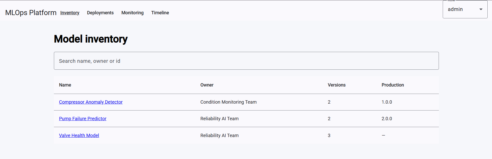
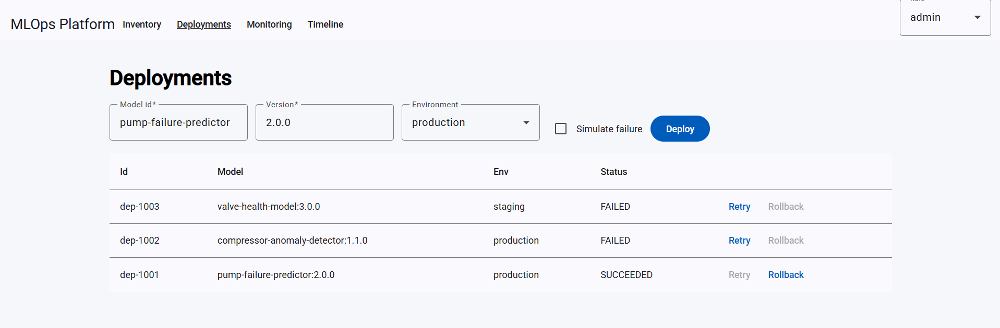
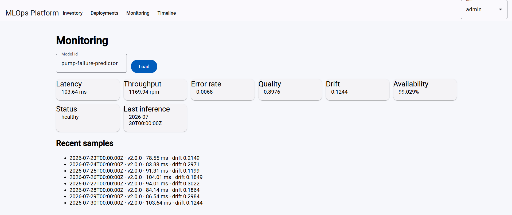

# MLOps platform (G12)

Assignment for **Principal / Tech Lead**: a small control plane for industrial models — register versions, promote them to staging, deploy, watch a few metrics, retry or roll back.

I did not train models. The interesting bits are the lifecycle rules, the async deploy worker, and making `docker compose up --build` actually work. Models and metrics in this repo come from **sample JSON and CSV** (see `data/`). The real pump-failure stack is a separate monorepo: **`pump-failure-mlops`** (`training/`, `serving/`, `platform/`).

## How it is put together

The Angular app is a thin client over REST. **MLflow** is the source of truth for models and versions; Postgres stores deployments and events. **Prometheus** stores operational metrics pushed by seed to **Pushgateway**; **Evidently AI** computes drift scores included in that push. FastAPI hands long-running deploys to Celery (Redis). The worker talks to a fake runtime so we can fail, retry and roll back without a GPU cluster.

Rules (who can go to production, what rollback is allowed) live in `backend/app/domain` and are unit-tested without the database. The UI does not reimplement them.

[Architecture notes](docs/architecture.md) · [diagram](docs/architecture-diagram.png)

Stack: Python 3.11, FastAPI, SQLAlchemy, Alembic, Postgres 16, Redis, Celery, **MLflow**, pytest, Angular 19 + Material, Docker Compose, GitHub Actions.

Images are built from `backend/Dockerfile` and `frontend/Dockerfile`. There is no root Dockerfile; Compose is the entrypoint.

## Run it

```bash
docker compose up --build
docker compose run --rm seed
```

Postgres user/password in Compose (`mlops`/`mlops`) is for local demo only.

- UI: http://localhost:4200
- API: http://localhost:8000
- Swagger: http://localhost:8000/docs
- MLflow UI: http://localhost:5000
- Prometheus: http://localhost:9090
- Pushgateway: http://localhost:9091
- Keycloak: http://localhost:8080 (admin console: `admin` / `admin`)

## Authentication (Keycloak)

Docker Compose runs **Keycloak** with realm **`mlops`** and OIDC client **`mlops-ui`**. The production frontend build uses the authorization-code flow with PKCE; the API validates JWTs (`AUTH_MODE=oidc`).

Demo users (password = username):

| User | Role |
|------|------|
| `viewer` | read-only |
| `approver` | promote to staging |
| `operator` | deploy / retry / rollback |
| `admin` | all of the above |

1. Open http://localhost:4200 → **Login** → sign in (e.g. `operator` / `operator`)
2. The UI sends `Authorization: Bearer …` on API calls; roles come from Keycloak realm roles

Local pytest and `ng serve` use `AUTH_MODE=header` and the role dropdown instead (see `.env.example`).

Without Docker: copy `.env.example`, bring up Postgres + Redis + MLflow + Keycloak, `alembic upgrade head` from `backend/`, then uvicorn + a Celery worker. `cd frontend && npm start` proxies `/api` to port 8000.

## Tests

```bash
cd backend && python -m pytest
cd frontend && npx ng test --watch=false --browsers=ChromeHeadless
```

## Trying the flows

Seed loads models/deployments from `data/sample_model_registry.json` and `data/sample_deployment_events.json`, replays `data/sample_model_metrics.csv` to **Pushgateway**, and runs Evidently drift checks per model.

- Inventory and version compare on Pump Failure Predictor (`1.0.0` vs `2.0.0`).
- Log in as `viewer`, hit Deploy — you should see the error card (403).
- Log in as `approver`, promote compressor `1.1.0` to staging; as `operator`, deploy and roll back.
- Check **Simulate failure**, deploy, Retry.
- Monitoring for `pump-failure-predictor`. Timeline is the event log.

`POST /deployments` with a repeated `Idempotency-Key` returns the original row. Production deploy from stage `None` is **409**.

With `AUTH_MODE=header` (tests / local dev), the toolbar role dropdown sends `X-Actor-Role`. With `AUTH_MODE=oidc` (Compose), use Keycloak login instead.

## Screenshots







## Docs

- [API](docs/api-design.md)
- [Tests](docs/test-strategy.md)
- [What I cut](docs/known-limitations.md)
- [ADR: async deploys](docs/adr/001-async-deployment.md)
- [ADR: uniqueness instead of Redis locks](docs/adr/002-idempotency-constraints.md)
- [Risks / follow-up](docs/risks.md)
